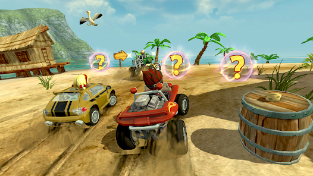
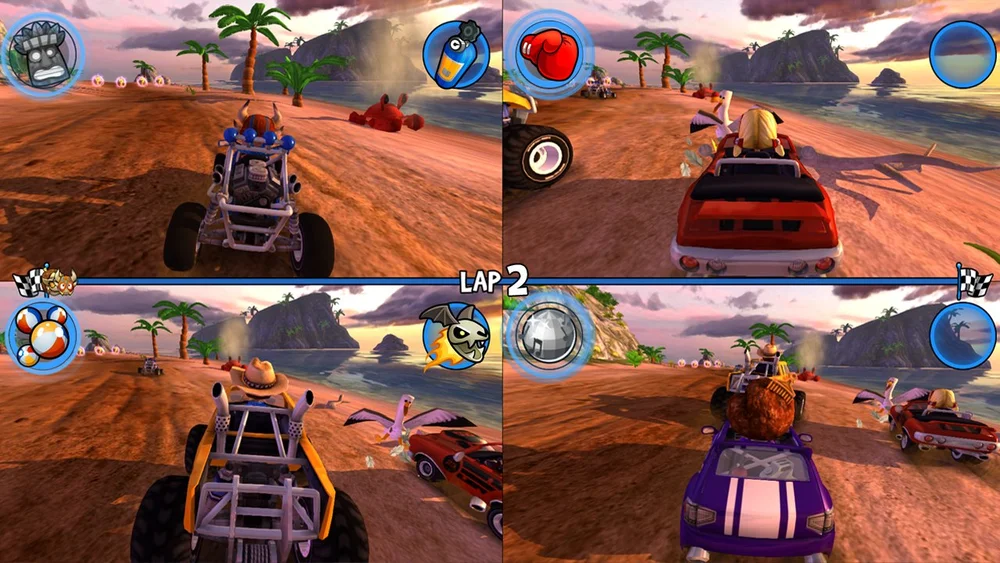

# Gesture Hero — Rise of the Motion Masters

> Contrôle un véhicule dans **Beach Buggy Racing** uniquement avec des gestes de la main — sans jamais toucher un clavier.

Projet réalisé lors du **Hackathon Arduino Days 2026 - Cotonou**.

---

## Le jeu : Beach Buggy Racing

<p align="center">
  
  
</p>
<p align="center">
  
</p>

---

## Comment ça marche

```
[Main] ──USB Serial──► [PC]
Arduino                  Python script
Nano 33                  (gesture_controller.py)
BLE Sense                  │
  │                        ▼
  IMU (accél + gyro)    pynput simule
  Edge Impulse model    les touches clavier
  → détecte le geste    → Beach Buggy Racing
```

1. **Arduino Nano 33 BLE Sense** : lit l'IMU (accéléromètre + gyroscope), fait tourner le modèle IA (Edge Impulse) embarqué, envoie le geste détecté via Serial USB.
2. **Script Python** : écoute le port série et convertit chaque geste en appui de touche clavier.

---

## Gestes reconnus

| Geste   | Touche simulée | Action dans le jeu |
|---------|----------------|--------------------|
| haut    | ↑              | Accélérer          |
| bas     | ↓              | Freiner / Reculer  |
| gauche  | ←              | Tourner à gauche   |
| droite  | →              | Tourner à droite   |

---

## Matériel nécessaire

- Arduino Nano 33 BLE Sense + câble USB
- PC avec Python 3.x
- Beach Buggy Racing (installé sur le PC)

---

## Installation

### 1. Modèle Edge Impulse → Arduino

1. Entraîne ton modèle sur [Edge Impulse Studio](https://studio.edgeimpulse.com) avec les 4 gestes ci-dessus.
2. Exporte le modèle en **Arduino library** (`.zip`).
3. Dans l'IDE Arduino : *Sketch → Include Library → Add .ZIP Library* → sélectionne le `.zip`.
4. Dans `arduino/gesture_hero.ino`, décommente le bloc `#include <gesture_hero_inferencing.h>` et le bloc d'inférence.
5. Flashe la carte.

### 2. Script Python

```bash
pip install pyserial pynput
python python/gesture_controller.py
```

Le script détecte automatiquement le port de l'Arduino.

---

## Structure du projet

```
gesture-hero/
├── arduino/
│   └── gesture_hero.ino          # Code Arduino (IMU + inférence + Serial)
├── esp32/                         # Ancienne version BLE (non utilisée)
│   └── gesture_relay_esp32/
├── python/
│   └── gesture_controller.py     # Serial → clavier (pynput)
├── model/                         # Mettre ici l'export Edge Impulse (.zip)
└── README.md
```

---

## Modèle IA

| Paramètre         | Valeur                        |
|-------------------|-------------------------------|
| Capteurs          | Accéléromètre + Gyroscope (6 axes) |
| Fenêtre           | 50 échantillons × 20 ms = 1 s |
| Labels            | haut, bas, gauche, droite, idle |
| Plateforme        | Edge Impulse (TinyML)         |
| Seuil de confiance | 70 %                         |

---

## Hackathon

- **Événement** : Arduino Days 2026 — Cotonou
- **Défi** : Gesture Hero — Rise of the Motion Masters
- **Dates** : 28-29 Mars 2026
